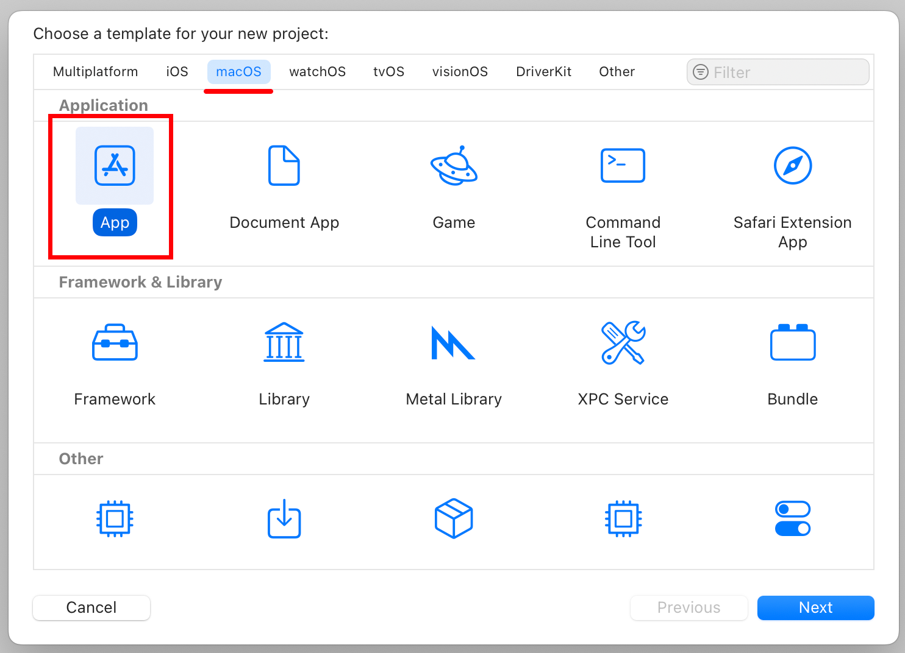
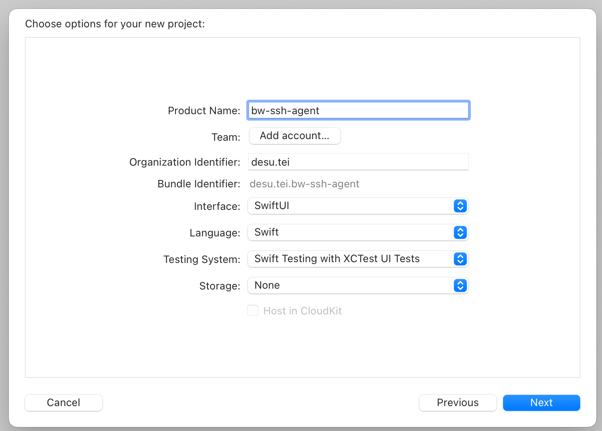
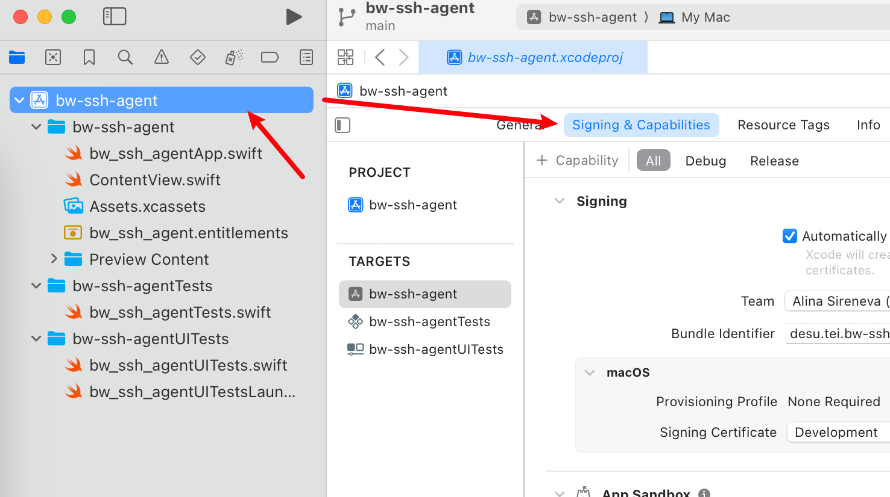
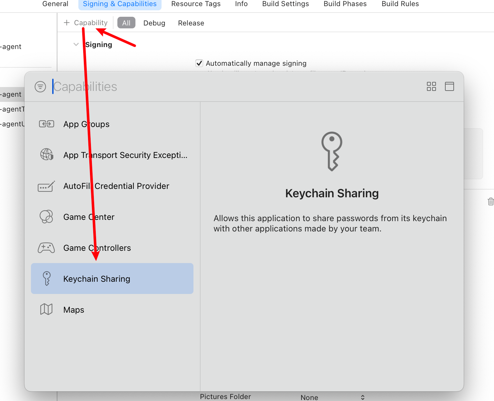
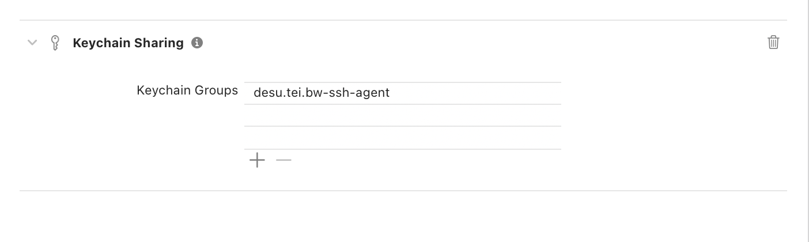
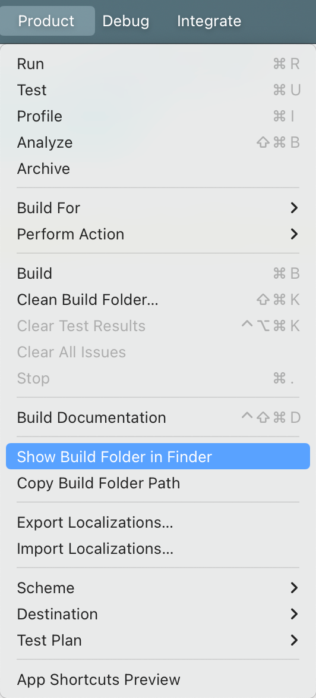
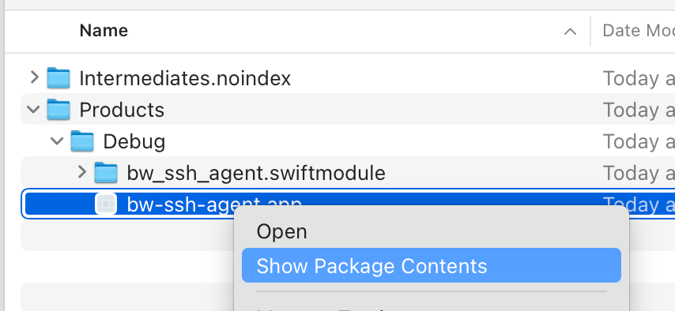
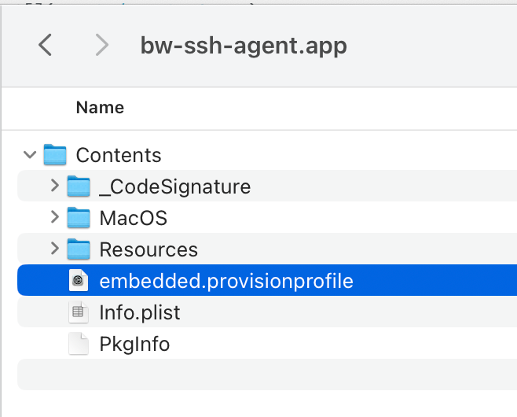

# entitlements guide

quick step by step guide how to get the magical `embedded.provisionprofile` file

1. open xcode, click create a new project
2. select macOS > App:
  
3. set product name to `bw-ssh-agent`, and choose a unique organization id (here we'll use `desu.tei`):
   make sure the bundle identifier is `desu.tei.bw-ssh-agent`:
   
   3.1. if there's no team chosen (as above), click "Add account" and sign in with your apple developer account.
   you **dont need** a dev certificate, just a team id.  
   3.2. after logging in, choose the team you want to use:
   
4. click "Next", choose any folder and click "Create"
5. click the project name in the left sidebar, click "Signing & Capabilities" tab:
   
6. click the + button in the bottom left corner and choose "Keychain Sharing":
   
7. scroll down to "Keychain Sharing", click + and put `desu.tei.bw-ssh-agent` as the application group:
    
8. run the app once
9. go to "Product" > "Show in Finder":  
    
10. find the `.app`, right click and choose "Show Package Contents":
    
11. go to `Contents` and there you have it!
    
12. yoink the file and put it into `assets/`
13. find out your team id by running this:
    ```bash
    security cms -D -i assets/embedded.provisionprofile | plutil -extract TeamIdentifier.0 raw -
    ```
    and put it into the `.env` file
14. find out your signing identity by running this:
    ```bash
    security find-identity -p codesigning -v
    ```
    and put the long hexadecimal string into the `.env` file
15. put the organization id from step 3 into the `.env` file
16. now you can FINALLY run `cargo make run` :>